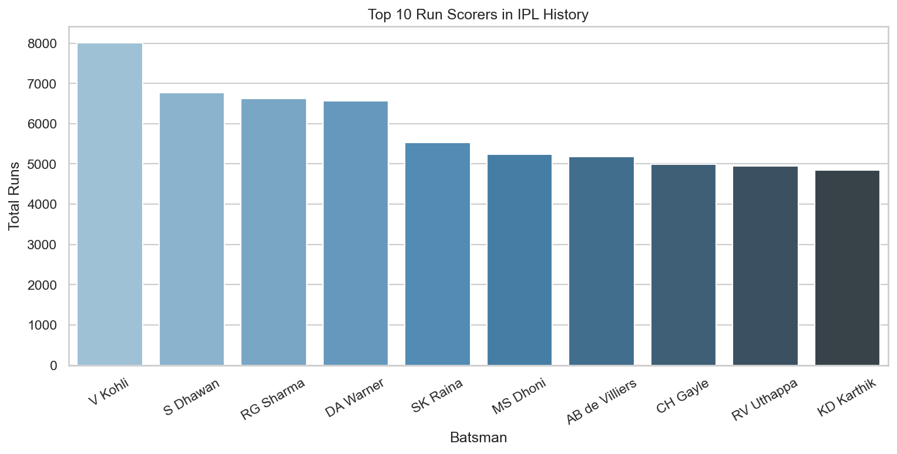
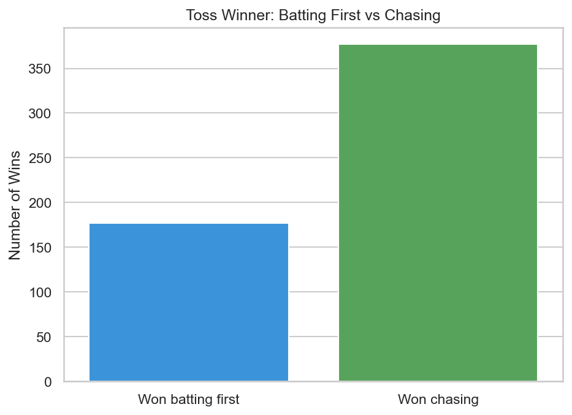
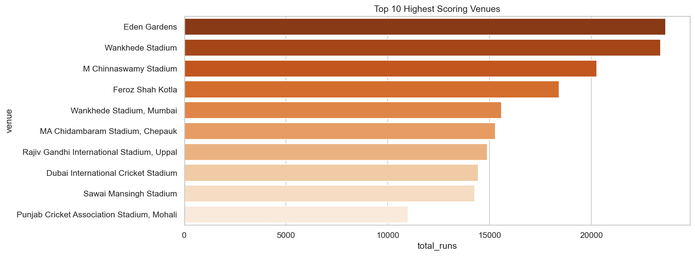
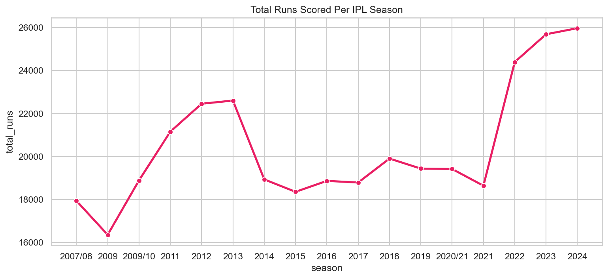

# 🏏 IPL Data Analysis — EDA on 17 Seasons of Cricket


Exploratory data analysis on IPL match and delivery data spanning 2007/08 to 2024. This project digs into batting performance, toss patterns, venue trends, and how scoring has evolved across 17 seasons.

---

## 📊 Key Findings

| Insight | Result |
|---|---|
| 🏆 All-time top run scorer | V Kohli (~8,000 runs) |
| 🏟️ Highest scoring venue | Eden Gardens |
| 🎯 Chasing wins (toss winner) | ~375 matches |
| 🏏 Batting first wins (toss winner) | ~175 matches |
| 📈 Highest scoring season | 2024 (~26,000 runs) |
| 📉 Lowest scoring season | 2009 (~16,500 runs) |

---

## 📈 Visualisations

### Top 10 Run Scorers in IPL History


V Kohli leads by a significant margin with ~8,000 runs, followed by S Dhawan, RG Sharma, and DA Warner all clustered around 6,500–6,800 runs.

---

### Toss Winner: Batting First vs Chasing


Teams that win the toss and choose to chase overwhelmingly win more matches — roughly 375 wins vs 175 for batting first.

---

### Top 10 Highest Scoring Venues


Eden Gardens and Wankhede Stadium are the two highest scoring venues, both crossing 22,000 total runs.

---

### Total Runs Per IPL Season


Run scoring dipped in the 2014–2021 period before a sharp spike from 2022 onwards.

---

## 🗂️ Project Structure
IPL-Data-Analysis/

│
├── IPL Data Analysis.ipynb   # Main analysis notebook
├── toss_analysis.png         # Chart: batting first vs chasing
├── top_batsmen.png           # Chart: top 10 run scorers
├── venues.png                # Chart: highest scoring venues
└── season_trends.png         # Chart: runs per season

## ▶️ How to Run

1. Clone the repo:
```bash
git clone https://github.com/Harshiniradha/IPL-Data-Analysis.git
```

2. Install dependencies:
```bash
pip install pandas numpy matplotlib seaborn jupyter
```

3. Download the dataset from [Kaggle](https://www.kaggle.com/datasets/patrickb1912/ipl-complete-dataset-20082020) and place `matches.csv` and `deliveries.csv` in the project folder

4. Open the notebook:
```bash
jupyter notebook "IPL Data Analysis.ipynb"
```

---

## 🔍 Questions Explored

- Which teams win more — batting first or chasing?
- Who are the top 10 run scorers across all IPL seasons?
- Which venues produce the highest scoring matches?
- How has total run scoring changed season by season?
- Does winning the toss give a meaningful advantage?

---

## 📬 Connect

[](https://linkedin.com/in/harshini-r-b9558a336)
[](https://github.com/Harshiniradha)
